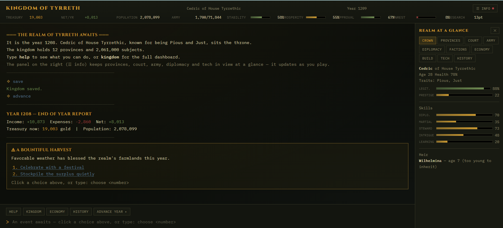

ARANDOR — Kingdom Chronicle
===

A fully client-side, vanilla JavaScript kingdom-management
simulation where you rule a medieval realm through commands,
manage provinces, build infrastructure, conduct diplomacy,
research technology, wage wars, and shape your kingdom's history.

Features
---

✓ Deterministic simulation <br>
✓ Province management<br>
✓ Economy & taxation<br>
✓ Population simulation<br>
✓ Technology tree<br>
✓ Royal court<br>
✓ Military & warfare<br>
✓ Diplomacy & alliances<br>
✓ Dynamic events<br>
✓ Historical chronicle<br>
✓ Save/load<br>
✓ JSON export/import<br>
✓ Terminal-style interface<br>
✓ No framework<br>
✓ No backend<br>
✓ No build step<br>
Tech Stack<br>
---

HTML5
CSS3
Vanilla JavaScript



## Running it

No build step, no server required.

```
open index.html
```

or just double-click it. 

## Project structure

```
kingdom-game/
├── index.html                  markup + <script> tags only, no inline JS/CSS
├── css/
│   └── styles.css              all styling
└── js/                         classic scripts, numbered in load order
    ├── 01-rng.js                seeded RNG (mulberry32) + math helpers
    ├── 02-data.js               names, cultures, unit costs, buildings, tax levels
    ├── 03-tech.js               tech tree + tech helper functions
    ├── 04-state.js              newProvince/newAIKingdom/initGame — builds S
    ├── 05-render-dashboard.js   terminal log + top dashboard rendering
    ├── 06-render-sidepanel.js   the "REALM AT A GLANCE" side panel tabs
    ├── 07-engine.js             the ONLY functions allowed to mutate state
    ├── 08-view-commands.js      read-only "view X" prints (dashboard-in-text)
    ├── 09-persistence.js        save/load (window.storage) + JSON export/import
    ├── 10-commands.js           the command parser (the big switch/case)
    ├── 11-ux-helpers.js         autocomplete, typo correction, history
    └── 12-bootstrap.js          wires up DOM listeners, starts the game
```


## Architecture

```
STATE  →  ENGINE (deterministic calc)  →  RENDER (text-only)
```

- **State** is the single global `S` object (built by `initGame()` in
  `04-state.js`). It's the only source of truth.
- **Engine** (`07-engine.js`) holds every function that's allowed to mutate
  `S` — building queues, recruiting/disbanding troops, taxes, diplomacy,
  war, the yearly simulation tick. Nothing outside this file should assign
  to `S.*` directly.
- **Render** (`05-render-dashboard.js`, `06-render-sidepanel.js`,
  `08-view-commands.js`) only reads `S` and produces HTML/text. Narrative
  flavor text is generated from state, never the reverse — state is never
  inferred from what's been printed.
- **Commands** (`10-commands.js`) is the glue: parses what you typed, calls
  an engine function, prints the result, re-renders.

## Playing

Type commands at the prompt, or use the quick-action buttons / side-panel
links, which just call `processCommand(...)` under the hood — there's no
separate code path for clicks vs. typing.

| Command | Does |
|---|---|
| `kingdom` | Full kingdom dashboard |
| `economy` | Itemized income/expense report |
| `provinces` / `province <name>` | List provinces / detail on one |
| `court` | Royal court advisors |
| `army` | Military forces, capacity, upkeep |
| `diplomacy [kingdom]` | Foreign kingdoms, or detail on one |
| `technology` / `research <name>` | Tech tree / set research focus |
| `tax <peasant\|trade\|noble> <low\|normal\|high>` | Set a tax rate |
| `build [type] [province]` | Build (or use the Build tab to click-to-build) |
| `recruit <unit> <n>` / `disband <unit> <n>` | Manage troops (limited by gold + army capacity) |
| `relations <kingdom> improve` | Send gifts, raise opinion |
| `alliance <kingdom>` | Propose an alliance (needs high opinion) |
| `war <kingdom>` / `peace <kingdom>` | Declare war / seek peace |
| `choose <n>` | Resolve a pending event |
| `advance` | Advance to the next year |
| `history` | Royal chronicle |
| `save` / `load` | Persist or restore in this browser |
| `export` / `import` | Download/paste a portable save file |
| `new` | Begin a new reign |

Full list is always available in-game via `help`.

### Army capacity

Total troops (all unit types combined) are capped by **army capacity**:
`3% of each province's population + that province's militaryPresence`
(militaryPresence rises with Barracks and Walls). Recruiting is blocked
or auto-capped once you hit the ceiling — grow your population or build
Barracks to raise it. See it in the Army side-panel tab or `army`.

### War

War now has three real stakes, not just a background number:

- **Casualties** — every year a war continues, both sides lose troops
  (0.5%–10% of manpower/year depending on how the fight is going). A
  running "lost to war" total shows in the Army panel.
- **Cost** — each active war adds a flat 250g/year "war expenditure" to
  your budget (see `economy`), and provinces gain war-weariness unrest
  while any war continues.
- **Territory** — war score is tracked from -100 to +100. Suing for peace
  (`peace <kingdom>`) at:
  - **≥ +75** — decisive victory: annex a province from the enemy + gold
  - **+25 to +75** — gold reparations only
  - **-25 to +25** — white peace, nothing changes hands
  - **-75 to -25** — you pay tribute
  - **≤ -75** — decisive defeat: you lose your weakest-loyalty province
    (never below 3 provinces total)

The Diplomacy side-panel tab shows a live war-score bar and a one-click
"Sue for peace" button once you're at war.

